# WellOff | React.JS, CSS, HTML | Side Project

This project was bootstrapped with [Create React App](https://github.com/facebook/create-react-app).

WellOff is a wellness app supporting multiple features that promote well-being. Details of the app are included below.

## Available Scripts

To run locally: 

Clone repo
### `npm install` 
### `npm run build`

## How the Web Application Works

Upon entering the app, you will be asked to login. In order to do so, you need to register an account.
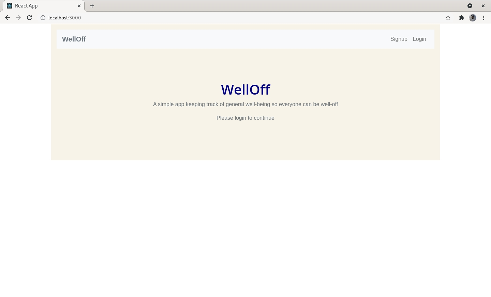
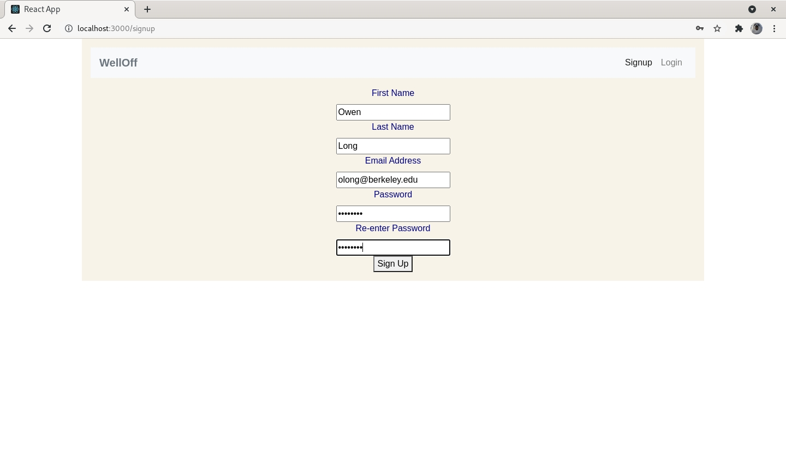
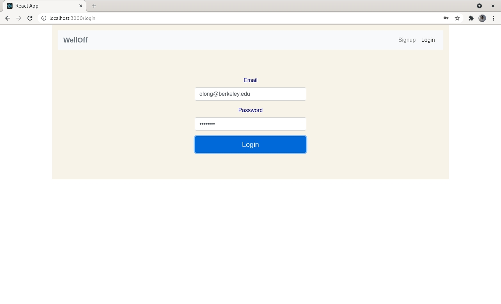
After registering and logging in, other options are then unlocked.
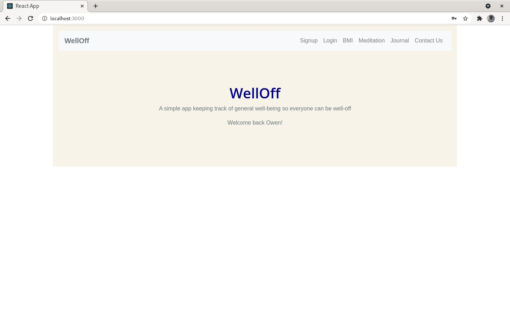
The user can input their weight and height to receive their BMI measurements. They can then choose to save their data as a text file.
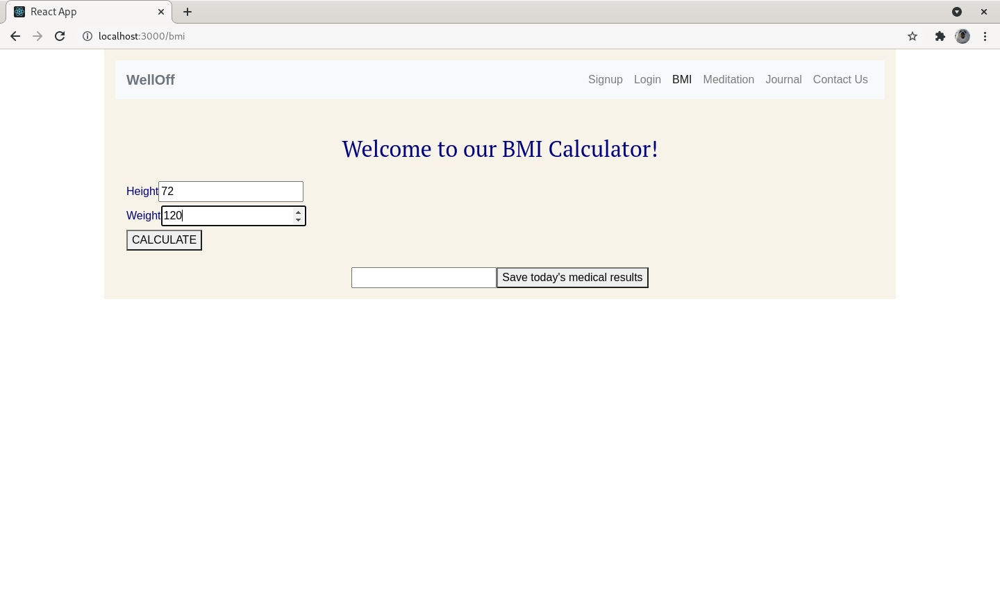
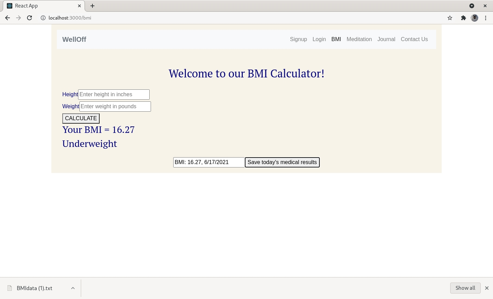
The user can choose a length of time to meditate for with a timer counting down. At the end of the countdown, the user has a choice to write down their thoughts and save them. They can also play classical music from three given options throughout the meditation and this is evident by the music icon in the top right corner. 
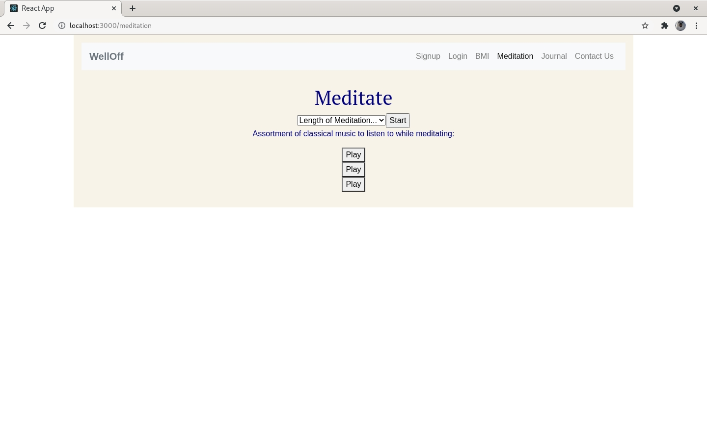
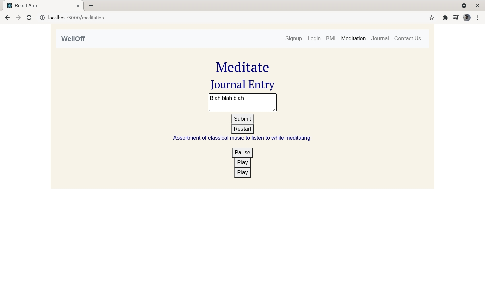
The user can journal their thoughts and their thoughts will be saved along with a timp stamp no matter if the page is refreshed.
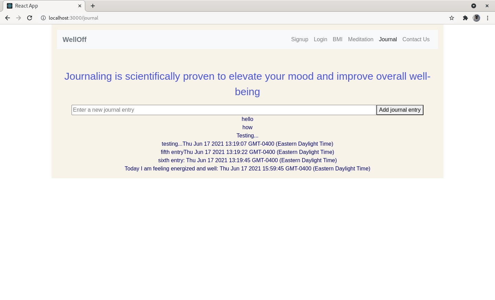
If the user has any feedback or wishes to contact me, they can do so and an email will be sent to me through EmailJs.
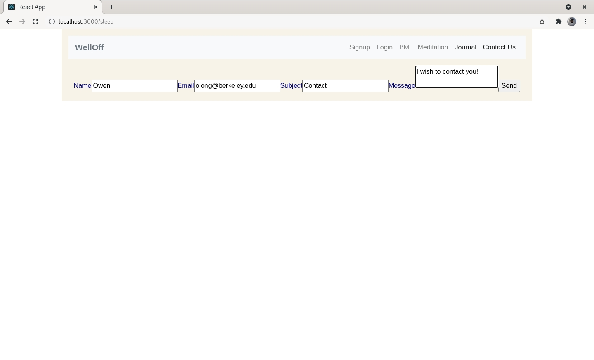
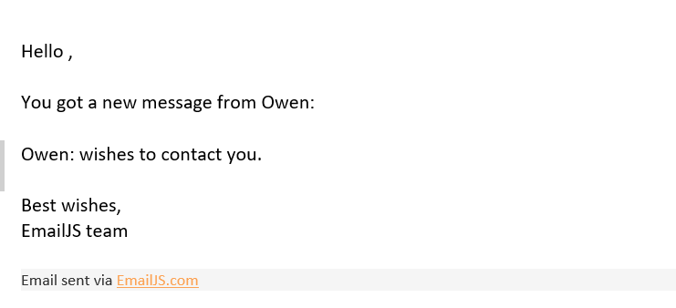

